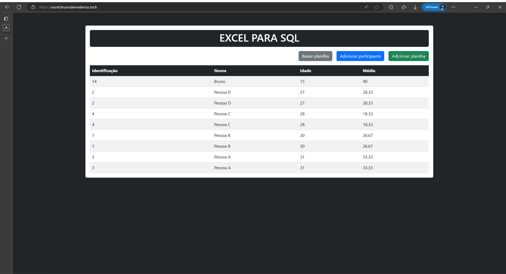

# Front-end

Aplicação criada usando Angular:

## Executando a aplicação

Com o node instalado, Execute o comando `npm i` dentro da pasta [frontend](/frontend/).
Após o término da instalação das dependências, executar o comando `npm start`.

Em ambiente de desenvolvimento, a aplicação manterá contato com o link **http://localhost:8080/api/v1/participants**, no qual é fornecido pelo backend.

A aplicação ficará rodando no `localhost:4200`

---

## Desenvolvido por

")

**[Retornar para página anterior](../README.pt-br.md)**

By <strong><a href="https://github.com/BrunoMedeiros14">Bruno Medeiros</a></strong>.

